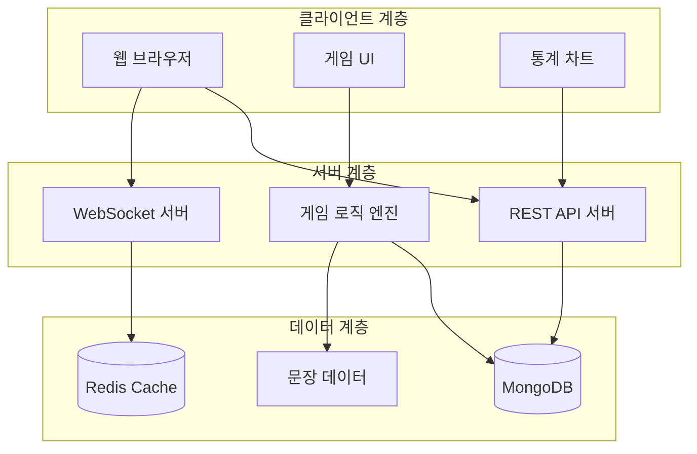
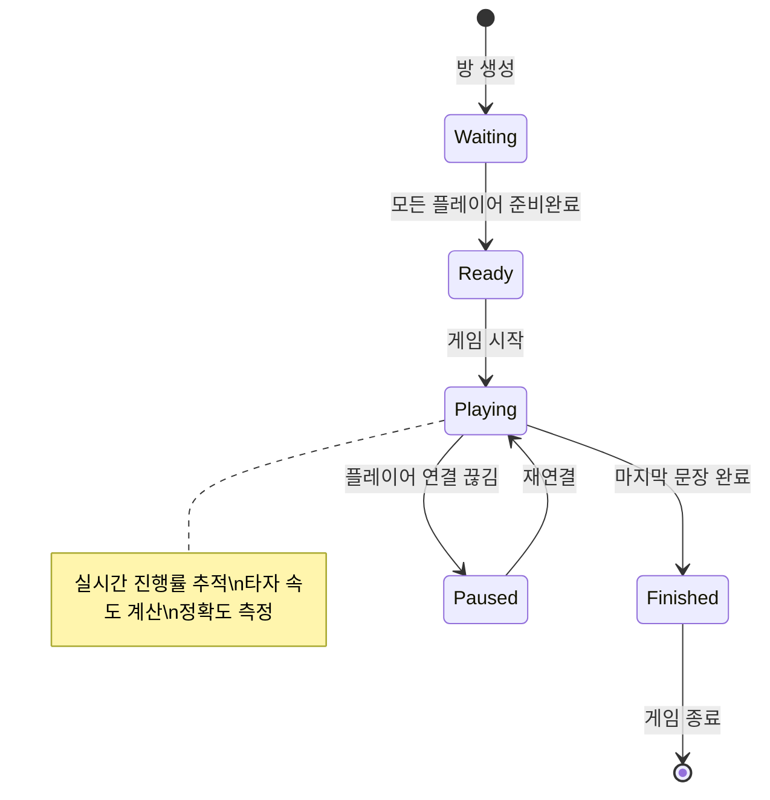
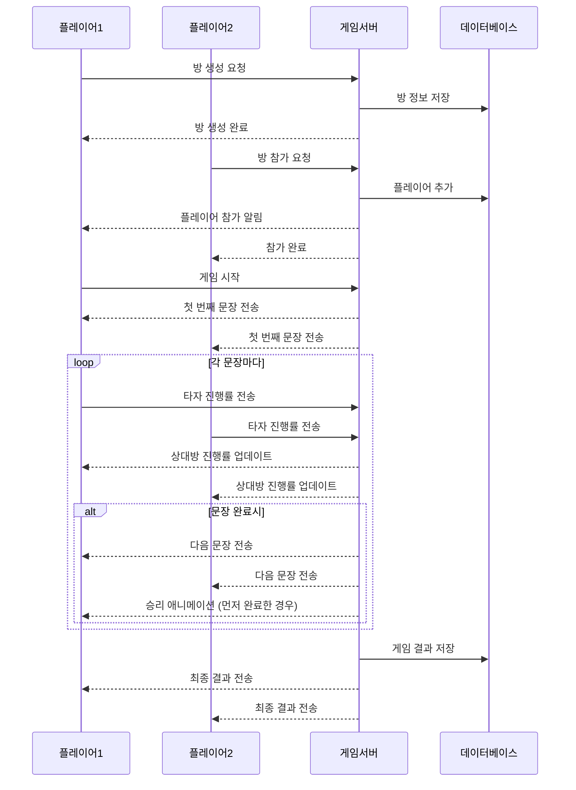
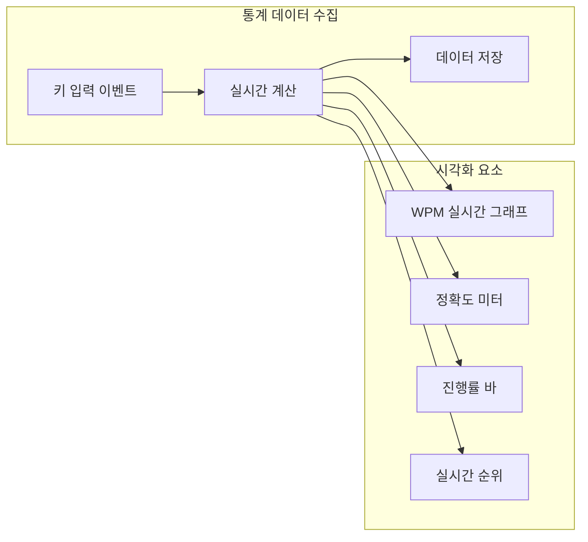

# 대결! 타자연습 웹 서비스 설계 문서

## 개요

### 프로젝트 목표
실시간으로 2명 이상의 플레이어가 타자 속도와 정확도를 겨루는 대결 게임 웹 서비스를 제공합니다. 플레이어들은 동일한 문장을 빠르고 정확하게 입력하여 경쟁하며, 다양한 게임 모드와 통계 기능을 통해 지속적인 재미와 동기부여를 제공합니다.

### 핵심 가치 제안
- **실시간 경쟁**: WebSocket을 통한 실시간 대결 시스템
- **시각적 피드백**: 애니메이션과 실시간 진행률 표시
- **게임화 요소**: 순위표, 통계, 레벨 시스템으로 참여 동기 부여
- **접근성**: 웹 브라우저만으로 바로 게임 참여 가능

### 주요 기능
- 실시간 멀티플레이어 타자 대결
- 문장별 애니메이션 효과 및 승리 알림
- 개인/전체 순위표 시스템
- 상세한 타자 통계 분석
- 다양한 난이도별 문장 제공
- 친구 초대 및 방 생성 기능

## 아키텍처

### 전체 시스템 아키텍처



### 기술 스택
- **백엔드**: Node.js, Express.js, Socket.IO
- **데이터베이스**: MongoDB (사용자/게임 데이터), Redis (세션/실시간 데이터)
- **프론트엔드**: HTML5, CSS3, JavaScript (ES6+), Canvas API
- **실시간 통신**: WebSocket (Socket.IO)
- **인증**: JWT 토큰 기반
- **배포**: Docker, Nginx

### 시스템 구성 요소

| 구성 요소 | 역할 | 기술 스택 |
|-----------|------|-----------|
| 게임 서버 | 실시간 게임 로직 처리 | Node.js, Socket.IO |
| API 서버 | RESTful API 제공 | Express.js |
| 데이터베이스 | 사용자 및 게임 데이터 저장 | MongoDB |
| 캐시 서버 | 세션 및 실시간 데이터 | Redis |
| 웹 클라이언트 | 사용자 인터페이스 | HTML5, CSS3, JavaScript |

## API 엔드포인트 레퍼런스

### 사용자 관리

| 엔드포인트 | 메서드 | 설명 | 인증 필요 |
|------------|--------|------|-----------|
| `/api/auth/register` | POST | 사용자 회원가입 | 아니오 |
| `/api/auth/login` | POST | 사용자 로그인 | 아니오 |
| `/api/auth/guest` | POST | 게스트 사용자 생성 | 아니오 |
| `/api/user/profile` | GET | 사용자 프로필 조회 | 예 |
| `/api/user/stats` | GET | 사용자 통계 조회 | 예 |

### 게임 관리

| 엔드포인트 | 메서드 | 설명 | 인증 필요 |
|------------|--------|------|-----------|
| `/api/room/create` | POST | 게임방 생성 | 예 |
| `/api/room/:id/join` | POST | 게임방 참가 | 예 |
| `/api/room/:id` | GET | 게임방 정보 조회 | 예 |
| `/api/game/history` | GET | 게임 기록 조회 | 예 |
| `/api/leaderboard` | GET | 순위표 조회 | 아니오 |

### 문장 관리

| 엔드포인트 | 메서드 | 설명 | 인증 필요 |
|------------|--------|------|-----------|
| `/api/sentences/:difficulty` | GET | 난이도별 문장 조회 | 아니오 |
| `/api/sentences/random` | GET | 랜덤 문장 조회 | 아니오 |

### 요청/응답 스키마

#### 게임방 생성 요청
```json
{
  "roomName": "문자열, 방 이름",
  "maxPlayers": "숫자, 최대 플레이어 수 (2-8)",
  "difficulty": "문자열, 난이도 (easy/medium/hard)",
  "sentenceCount": "숫자, 문장 개수 (5-50)",
  "isPrivate": "불린, 비공개 방 여부"
}
```

#### 게임 진행 상태 응답
```json
{
  "gameId": "문자열, 게임 ID",
  "currentSentence": "문자열, 현재 문장",
  "sentenceIndex": "숫자, 현재 문장 번호",
  "totalSentences": "숫자, 전체 문장 수",
  "players": [
    {
      "userId": "문자열, 사용자 ID",
      "nickname": "문자열, 닉네임",
      "progress": "숫자, 진행률 (0-100)",
      "wpm": "숫자, 분당 타자 수",
      "accuracy": "숫자, 정확도 (%)"
    }
  ],
  "timeRemaining": "숫자, 남은 시간 (초)"
}
```

## 데이터 모델

### 사용자 모델

| 필드 | 타입 | 설명 | 제약사항 |
|------|------|------|----------|
| userId | ObjectId | 사용자 고유 ID | Primary Key |
| nickname | String | 사용자 닉네임 | 필수, 유니크, 2-20자 |
| email | String | 이메일 주소 | 유니크 (회원가입시) |
| isGuest | Boolean | 게스트 사용자 여부 | 기본값: false |
| totalGames | Number | 총 게임 수 | 기본값: 0 |
| wins | Number | 승리 횟수 | 기본값: 0 |
| bestWpm | Number | 최고 WPM | 기본값: 0 |
| averageAccuracy | Number | 평균 정확도 | 기본값: 0 |
| level | Number | 사용자 레벨 | 기본값: 1 |
| experience | Number | 경험치 | 기본값: 0 |
| createdAt | Date | 생성일 | 자동 생성 |
| lastActiveAt | Date | 마지막 활동일 | 자동 업데이트 |

### 게임방 모델

| 필드 | 타입 | 설명 | 제약사항 |
|------|------|------|----------|
| roomId | ObjectId | 방 고유 ID | Primary Key |
| roomName | String | 방 이름 | 필수, 1-50자 |
| hostId | ObjectId | 방장 사용자 ID | 필수 |
| maxPlayers | Number | 최대 플레이어 수 | 2-8 |
| currentPlayers | Number | 현재 플레이어 수 | 기본값: 0 |
| difficulty | String | 난이도 | easy/medium/hard |
| sentenceCount | Number | 문장 개수 | 5-50 |
| isPrivate | Boolean | 비공개 방 여부 | 기본값: false |
| gameStatus | String | 게임 상태 | waiting/playing/finished |
| players | Array | 참가자 목록 | 사용자 ID 배열 |
| createdAt | Date | 생성일 | 자동 생성 |

### 게임 기록 모델

| 필드 | 타입 | 설명 | 제약사항 |
|------|------|------|----------|
| gameId | ObjectId | 게임 고유 ID | Primary Key |
| roomId | ObjectId | 방 ID | 필수 |
| players | Array | 플레이어 결과 | 객체 배열 |
| sentences | Array | 사용된 문장 목록 | 문자열 배열 |
| winner | ObjectId | 승리자 사용자 ID | 필수 |
| duration | Number | 게임 진행 시간 (초) | 필수 |
| startedAt | Date | 시작 시간 | 필수 |
| finishedAt | Date | 종료 시간 | 필수 |

### 문장 모델

| 필드 | 타입 | 설명 | 제약사항 |
|------|------|------|----------|
| sentenceId | ObjectId | 문장 고유 ID | Primary Key |
| text | String | 문장 내용 | 필수, 10-200자 |
| difficulty | String | 난이도 | easy/medium/hard |
| language | String | 언어 | 기본값: "ko" |
| category | String | 카테고리 | 옵션 |
| averageWpm | Number | 평균 WPM | 계산값 |
| usageCount | Number | 사용 횟수 | 기본값: 0 |

## 비즈니스 로직 계층

### 게임 로직 아키텍처

#### 게임 진행 상태 관리



#### 실시간 게임 플로우



### 핵심 비즈니스 기능

#### 타자 속도 및 정확도 계산
- **WPM (Words Per Minute) 계산**: `(정확히 입력한 문자 수 / 5) / (경과 시간(분))`
- **정확도 계산**: `(정확한 문자 수 / 전체 입력 문자 수) × 100`
- **실시간 업데이트**: 매 키 입력마다 계산하여 상대방에게 전송

#### 게임 매칭 시스템
- **빠른 매칭**: 대기 중인 공개 방에 자동 배정
- **커스텀 방**: 사용자가 설정한 조건으로 방 생성
- **친구 초대**: 방 코드를 통한 특정 사용자 초대
- **난이도 매칭**: 비슷한 레벨의 플레이어 우선 매칭

#### 레벨 및 경험치 시스템
- **경험치 획득**: 게임 완료, 승리, 높은 WPM 달성시 획득
- **레벨업 조건**: 누적 경험치에 따른 단계별 레벨 상승
- **보상 시스템**: 레벨업시 특별 타이틀이나 아바타 해금

#### 순위표 시스템
- **전체 순위**: 최고 WPM 기준 전체 사용자 순위
- **주간 순위**: 주간 최고 성과 기준 순위
- **친구 순위**: 친구 간의 상대적 순위
- **카테고리별 순위**: 난이도별, 언어별 세분화된 순위

## 미들웨어 및 인터셉터

### 인증 미들웨어
- **JWT 토큰 검증**: API 요청시 토큰 유효성 확인
- **게스트 사용자 처리**: 임시 토큰을 통한 게스트 게임 참여
- **권한 검증**: 방 관리 권한, 게임 참여 권한 확인

### 실시간 통신 미들웨어
- **연결 관리**: WebSocket 연결 생성/해제 처리
- **방 입장/퇴장**: 실시간 방 상태 업데이트
- **메시지 라우팅**: 게임 이벤트별 적절한 핸들러 연결
- **재연결 처리**: 네트워크 끊김시 자동 재연결 및 상태 복구

### 데이터 검증 미들웨어
- **입력 검증**: 사용자 입력 데이터 형식 및 범위 검증
- **스팸 방지**: 과도한 요청 차단 및 속도 제한
- **보안 필터**: XSS, SQL Injection 등 보안 위협 차단

### 로깅 및 모니터링
- **게임 로그**: 게임 진행 과정 상세 기록
- **성능 모니터링**: 응답 시간, 처리량 측정
- **오류 추적**: 예외 상황 자동 감지 및 알림

## 고급 기능 확장

### 통계 및 분석 기능

#### 개인 통계 대시보드
- **진행률 그래프**: 시간별 WPM 향상도 시각화
- **정확도 트렌드**: 날짜별 정확도 변화 추이
- **문장별 성과**: 각 문장 타입별 평균 성능
- **약점 분석**: 자주 실수하는 문자나 단어 패턴 분석

#### 게임 통계 차트



### 소셜 기능
- **친구 시스템**: 친구 추가, 친구와의 전적 비교
- **길드/팀**: 그룹 단위 경쟁 및 협력
- **채팅 시스템**: 게임 중 간단한 이모티콘 채팅
- **공유 기능**: 개인 기록을 SNS에 공유

### 게임 모드 다양화
- **속도전 모드**: 제한 시간 내 최대한 많은 문장 입력
- **정확도 모드**: 실수 허용 한계가 낮은 고정밀 모드
- **릴레이 모드**: 팀원이 번갈아가며 문장 완성
- **토너먼트 모드**: 다단계 토너먼트 대진
- **연습 모드**: 혼자서 실력 향상에 집중

### 애니메이션 및 시각 효과
- **타자 효과**: 키 입력시 파티클 효과 및 사운드
- **진행률 시각화**: 실시간 프로그레스 바 및 캐릭터 애니메이션
- **승리 연출**: "닉네임 Win!" 텍스트와 함께 폭죽, 색종이 효과
- **문장 전환 효과**: 슬라이드, 페이드 등 부드러운 전환 애니메이션
- **실시간 대결 표시**: 플레이어간 진행률 비교 시각화

### 커스터마이징 기능
- **테마 선택**: 다크/라이트 모드, 색상 테마 변경
- **글꼴 설정**: 사용자 선호 글꼴 및 크기 조정
- **키보드 레이아웃**: 다양한 키보드 배열 지원
- **음향 효과**: 타자음, 효과음 On/Off 및 볼륨 조절

## 테스팅 전략

### 단위 테스트
- **게임 로직 테스트**: 점수 계산, 순위 결정 로직 검증
- **API 엔드포인트 테스트**: 각 API의 요청/응답 검증
- **데이터 모델 테스트**: 데이터 검증 및 제약사항 확인
- **WebSocket 이벤트 테스트**: 실시간 통신 메시지 처리 검증

### 통합 테스트
- **멀티플레이어 시나리오**: 여러 플레이어 동시 접속 테스트
- **네트워크 장애 시나리오**: 연결 끊김 및 재연결 테스트
- **동시성 테스트**: 동시 다발적 게임 진행 상황 검증
- **성능 테스트**: 최대 동접자 수 및 응답 시간 측정

### 사용자 시나리오 테스트
- **게임 플로우**: 방 생성부터 게임 완료까지 전체 흐름
- **크로스 브라우저**: 다양한 브라우저에서의 호환성
- **모바일 반응형**: 모바일 기기에서의 사용성
- **접근성**: 키보드 내비게이션 및 스크린 리더 지원